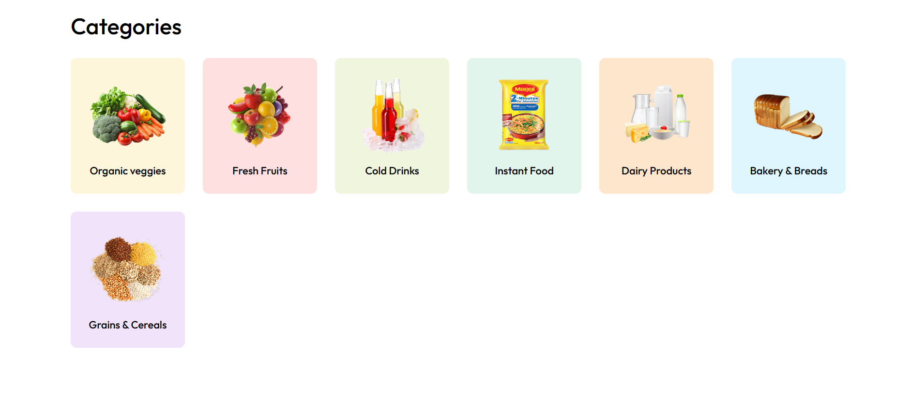
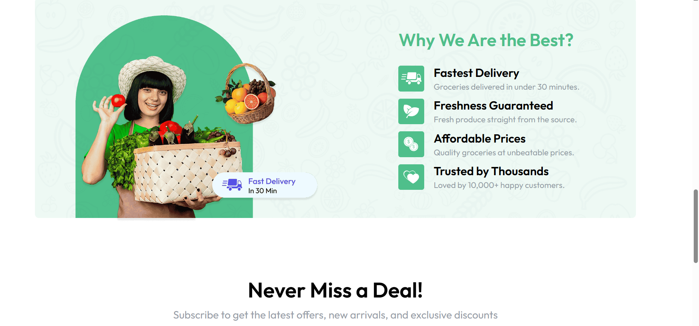
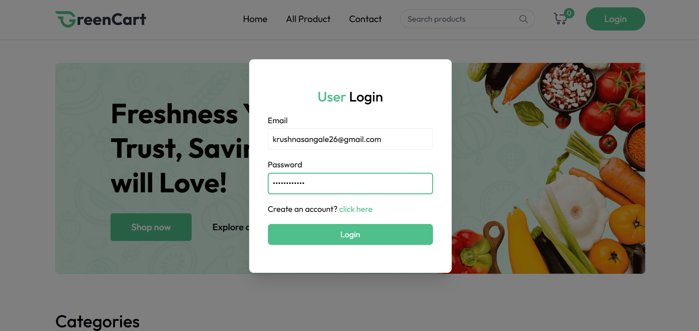
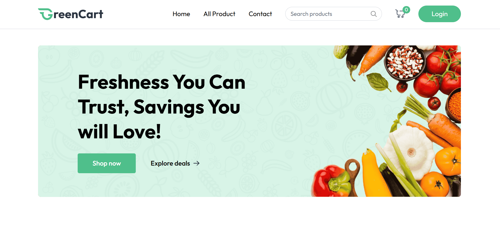
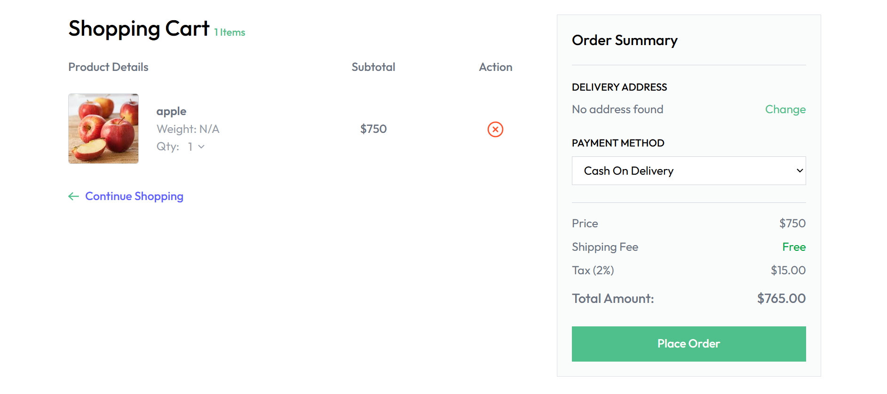

# 🛒 GreenCart

GreenCart is a **full-stack web application** built with the **MERN stack (MongoDB, Express.js, React.js, Node.js)**.  
It allows users to browse, buy, and manage eco-friendly products, providing a seamless shopping experience while promoting sustainable products.

---

## 🚀 Features

- 🔐 **User Authentication** – Secure login and registration  
- 🏷️ **Product Listings** – Browse, add, edit, and delete eco-friendly products  
- 🛒 **Shopping Cart & Checkout** – Add products, view cart, and complete purchases  
- 💳 **Payment Integration** – Stripe / secure payment gateway  
- 📦 **Order Management** – Track and manage orders  
- 🌱 **Sustainability Focus** – Encourages buying eco-friendly products  
- 📈 **Rewards & Incentives** – Earn rewards for sustainable purchases

---

## 🛠️ Tech Stack

| Technology     | Purpose                      |
|----------------|-----------------------------|
| MongoDB        | Database                     |
| Express.js     | Backend framework            |
| React.js       | Frontend framework           |
| Node.js        | Backend runtime              |
| Redux / Context| State management             |
| TailwindCSS / CSS | Styling & responsive design|
| Stripe API     | Payment processing           |

---

## ⚙️ Installation & Setup

1. **Clone the repository**
   ```bash
   git clone https://github.com/YashSahsani/GreenCart.git
   ```
2. **Navigate to the project folder**
   ```bash
   cd GreenCart
   ```
3. **Install backend dependencies**
   ```bash
   cd server
   npm install
   ```
4. **Install frontend dependencies**
   ```bash
   cd ../client
   npm install
   ```
5. **Set up environment variables**
   - Create a `.env` file in the **server** folder
   - Add your variables:
     ```
     MONGO_URI=your_mongo_db_connection
     JWT_SECRET=your_jwt_secret
     STRIPE_KEY=your_stripe_key
     ```
6. **Run the backend server**
   ```bash
   cd ../server
   npm start
   ```
7. **Run the frontend React app**
   ```bash
   cd ../client
   npm start
   ```
8. Open `http://localhost:3000` in your browser.

---

## 📂 Project Structure

```
GreenCart/
├── client/           # React frontend
│   ├── src/
│   │   ├── components/
│   │   ├── pages/
│   │   ├── redux/ or context/
│   │   └── App.js
│   └── package.json
├── server/           # Node + Express backend
│   ├── models/
│   ├── routes/
│   ├── controllers/
│   ├── middleware/
│   ├── server.js
│   └── package.json
└── Images/           # Screenshots of the app
```

---

## 📸 Screenshots

### 📂 Categories Page


### 🚚 Delivery Page


### 🔐 Login Page


### 🏠 Main Menu


### 🛒 Shopping Cart Page


### ✍️ Sign Up Page


---

## 📜 License
This project is licensed under the [MIT License](LICENSE).

---

### 👨‍💻 Author
Developed by **Krushna Sangale** as a MERN stack React-based open-source eco-friendly e-commerce project.

